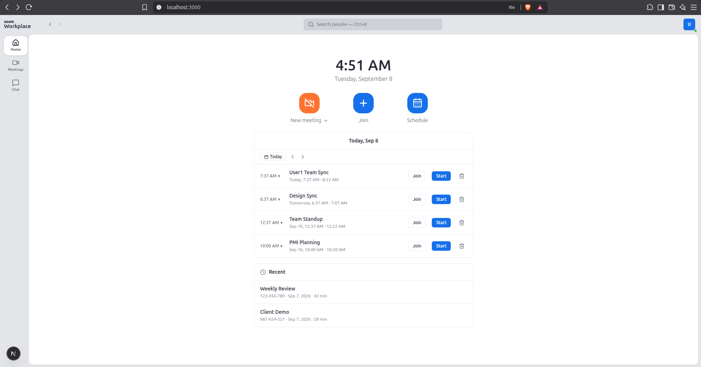
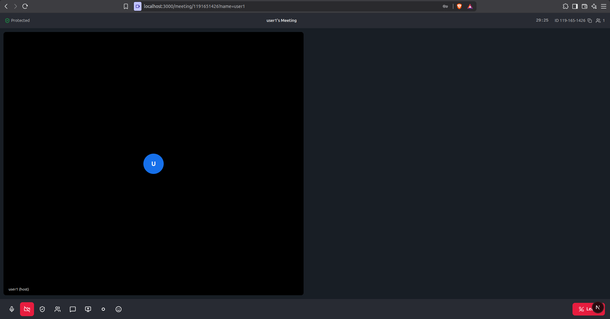

# Zoom Clone — Video Conferencing Platform

A full-stack Zoom Workplace clone with a real multi-person video room:
dashboard, instant meetings, validated join flow, scheduling, waiting rooms,
host controls, direct messaging, and user invitations — built with Next.js,
FastAPI, SQLite, and native WebRTC (no third-party video SDK, no API keys).

## Screenshots

| Dashboard | Live meeting room |
|---|---|
|  |  |

## Features

### Dashboard
- Zoom Workplace-style home: live clock, New / Join / Schedule tiles, calendar
  card with day navigation (Today/arrows), Upcoming list with per-meeting
  details dropdown (ID, description, passcode, duration, invite link + copy),
  and Recent meetings with delete.
- Meetings tab with a permanent Personal Meeting ID (PMI) card, upcoming list,
  inline topic editing, invitation preview, and a Security section (passcode +
  waiting-room controls).
- Everything is per-user: each account sees only its own meetings.

### Instant meetings
- One click creates a meeting with a unique 10-digit ID and a shareable invite
  link, and takes the host straight into the room.
- A host capability token is issued at creation for media-layer privileges.

### Join flow
- Join by meeting ID (auto-formatted `123-456-789`) or invite link, with a
  display name, across three gates: existence check (404), host-started check
  (409), passcode check (403 + rate-limited), and ended check (410).
- Pre-join screen with live camera preview, mic/camera toggles, passcode field,
  and a waiting-room screen that auto-enters on admission.

### Scheduling
- Topic (defaults to `{you}'s Zoom Meeting`), description, date/time pickers,
  duration, timezone auto-detection, auto or PMI meeting ID, random passcode
  with visibility toggle, waiting-room toggle, and host/participant video
  policy (actually enforced on join). Scheduling into your PMI updates the
  room in place.

### Meeting room (real WebRTC)
- Full-mesh peer-to-peer video/audio (Google STUN), gallery view, duration
  countdown with auto-end, screen sharing (`replaceTrack`, auto-revert),
  local recording (`.webm` download), emoji reactions, in-meeting chat,
  participants roster, waiting-room lobby with admit toast, and host controls
  (mute all/one, remove, end for all).

### Accounts, chat & invites
- Simple login (`user1/user1`, `user2/user2`) backed by HttpOnly session
  cookies; presence status; per-user PMI rooms with idle/live lifecycle.
- 1:1 direct messages with persistent server-side history.
- Username search with one-click meeting invitations delivered to an inbox
  (Join/Decline, duplicates and ended meetings filtered).

## Tech stack

| Layer | Choice |
|---|---|
| Frontend | Next.js 16, React 19, TypeScript (strict), Tailwind v4 |
| Backend | FastAPI, raw `sqlite3` (no ORM), native WebSockets |
| Database | SQLite, hand-designed 6-table schema (`users`, `meetings`, `participants`, `invites`, `messages`, `sessions`) |
| Realtime media | Native WebRTC mesh (mesh fits small rooms; an SFU would replace it at scale) |

## Quick start

**Backend** (Python 3.10+, terminal 1):

```bash
cd backend
python3 -m venv .venv
.venv/bin/pip install -r requirements.txt
.venv/bin/python seed.py        # creates zoom.db: 2 users, PMI rooms, samples
.venv/bin/uvicorn main:app --reload --port 8000
```

**Frontend** (Node 18+, terminal 2):

```bash
cd frontend
npm install
npm run dev                     # http://localhost:3000
```

Copy `frontend/.env.example` to `frontend/.env.local` if you need a non-default
API URL. Interactive backend docs: `http://localhost:8000/docs`.

**Demo accounts:** `user1 / user1` and `user2 / user2`. Open a normal window and
an incognito window to act as two people (host + guest).

**Two-person test:** user1 Starts an instant meeting → user2 joins by ID →
waiting screen → user1 Admits from the roster → live video both ways.

## Project structure

```
frontend/src/
  app/                  route files (thin: each renders one component)
    (workspace)/        dashboard shell pages: /, /meetings, /join, /schedule, /chat
    prejoin/            camera check + waiting screen
    meeting/[id]/       video room
  components/           AppShell, ProfileMenu, HomeTab, MeetingsTab,
                        JoinView, ScheduleView, ChatView, MeetingRoom/*
  lib/                  api.ts (all backend calls), types.ts, session.ts
backend/
  main.py               REST endpoints + WebSocket signaling
  database.py           schema, connections, hashing, self-migrating init_db
  seed.py               idempotent demo data (safe to re-run)
```

## API overview

| Area | Endpoints |
|---|---|
| Auth | `POST /auth/login`, `POST /auth/logout`, `GET /auth/me` |
| Meetings | `POST /meetings/instant`, `POST /meetings/scheduled`, `GET /meetings/{id}`, `PATCH /meetings/{id}`, `POST /meetings/{id}/start\|end`, `DELETE /meetings/{id}`, `GET /meetings?status=`, `GET /meetings/recent/list`, `GET /meetings/{id}/host-view` |
| Join flow | `POST /meetings/{id}/join`, `GET /meetings/{id}/admission/{pid}`, `GET /meetings/{id}/lobby`, `POST /meetings/{id}/admit/{pid}`, `POST /meetings/{id}/claim` |
| Social | `GET /users/search`, `POST /meetings/{id}/invite`, `GET /invites/inbox`, `POST /invites/{id}/accept\|decline`, `GET /messages/thread`, `POST /messages` |
| Realtime | `WS /ws/{meeting_id}?name=&host=&pid=` — offer/answer/ICE forwarding, chat, mute, reactions, host-only controls, presence, auto-cleanup |

## Security model

- **Sessions:** login mints a server-side session served as an HttpOnly cookie
  (`SameSite=None; Secure`, works on localhost and HTTPS). Every host operation
  verifies the caller owns the meeting — one user cannot touch another's
  meetings, even via direct API calls (401 logged out, 403 otherwise).
- **Capabilities:** per-meeting `host_token` (media privileges + waiting-room
  bypass), issued once at create/claim, kept in tab-scoped `sessionStorage`.
- **Guest gates:** passcodes (5 wrong attempts → 60s lockout), waiting rooms
  with host admission, idle PMI rooms reject joins until started.
- **Hygiene:** secrets stripped from all public serializers, parameterized
  queries throughout, no `dangerouslySetInnerHTML`, empty socket rooms GC'd,
  disconnects stamp `left_at` so headcounts stay honest.

Demo-grade by design: SHA-256 password hashing, in-process rate-limit counters,
plaintext HTTP on LAN. Production would use bcrypt + JWT, Redis throttles, and
TLS — the ownership checks stay identical.

## Assumptions made

- **Two demo users only** (`user1/user1`, `user2/user2`, password == name).
  No registration page — accounts are seeded, which is enough to demo every
  host/guest interaction (use a normal window + an incognito window).
- **One user per browser profile.** Identity is a server-side session cookie;
  switching users means signing out and back in.
- **Small rooms (2–4 people).** Media is a full WebRTC mesh, so quality and
  bandwidth degrade past ~6 participants — a production build would swap in
  an SFU (e.g. LiveKit) without changing the signaling design.
- **Same-network media.** No TURN server is configured, so peers behind
  symmetric NATs may fail to connect; localhost and same-LAN always work.
- **SQLite + local file.** Fine for a demo and the assignment's required stack;
  concurrent writers serialize. `seed.py` is idempotent — safe to re-run.
- **Local recording, not cloud.** The record button captures your own
  camera+mic to a `.webm` download; there is no server-side recording.
- **Display names are self-asserted.** Guests type any name; the roster trusts
  it (real identity would require SSO).
- **Passcodes are short (6 digits)** and brute-force protection is an
  in-memory counter (resets on restart) — correct shape, demo scale.
- **Meeting durations count from room entry**, not wall-clock schedule time,
  so old test meetings never instantly expire on join.
- **PMI rooms are permanent** (`idle` → `live` → `idle`); scheduled/instant
  meetings end permanently. Ending a PMI never deletes it.

## Deployment

- **Frontend → Vercel:** root `frontend/`, set `NEXT_PUBLIC_API_URL` to the backend URL.
- **Backend → Render/Railway:** root `backend/`, `uvicorn main:app`, run `seed.py` once,
  persist `zoom.db` (or point at Postgres and swap the `sqlite3` calls).
- Never commit `.env.local`, `zoom.db`, `.venv/`, or `node_modules/` (see `.gitignore`).
