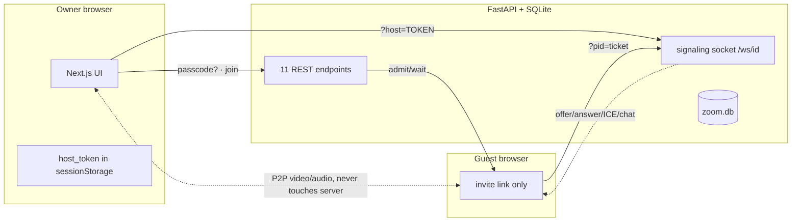

# Zoom Clone — Video Conferencing Platform (SDE Fullstack Assignment)

A Zoom Workplace web-app clone: dashboard, instant meetings, join with validation,
scheduling, and a real multi-person video room (WebRTC mesh + FastAPI signaling).

**Stack:** Next.js 16 + React 19 + Tailwind v4 (frontend) · FastAPI + SQLite
(`sqlite3` stdlib, no ORM) + native WebSocket signaling (backend) · WebRTC mesh, no
third-party video SDK (no API keys, works offline on LAN).

---

## 1. Run it (2 terminals)

**Backend** — needs Python 3.10+:

```bash
cd backend
python3 -m venv .venv
.venv/bin/pip install -r requirements.txt
.venv/bin/python seed.py        # creates zoom.db + demo user + sample meetings
.venv/bin/uvicorn main:app --reload --port 8000
```

Backend lives at `http://localhost:8000` · auto API docs at
`http://localhost:8000/docs` (great for demos).

**Frontend** — needs Node 18+:

```bash
cd frontend
npm install
npm run dev
```

App lives at `http://localhost:3000`. It expects the backend on port 8000
(`frontend/.env.local` → `NEXT_PUBLIC_API_URL`).

**Demo logins (password == name):** `user1 / user1`, `user2 / user2`.
Login sets an HttpOnly session cookie (`zc_session`, SameSite=None+Secure —
works on localhost and on HTTPS deploys, which is why Vercel auto-HTTPS
matters here). Only these two users exist — logged out, lists show
"Please login first."
Sign in/out from the avatar menu (top-right). Identity is
kept per-browser in localStorage — open a normal window + an incognito window
to be two different users: one hosts/schedules, the other joins.
Seeded cross-test meeting: `User1 Team Sync` (hosted by user1 — sign in as
user2 in another window and join it by ID).

**Backend down?** Lists show "Please login first" / empty states — every
write path reports its error inline instead of failing silently.

---

## 2. What the PDF asked vs what we built

| # | PDF requirement | Status | How it works | Test it |
|---|---|---|---|---|
| 1 | Landing dashboard: navbar + profile, New/Join/Schedule buttons, Upcoming, Recent | ✅ | `HomeTab.tsx` renders 3 tiles + calendar card + Recent card; data from `GET /meetings?status=scheduled` and `GET /meetings/recent/list`, mapped by `toUpcoming`/`toRecent` in `lib/api.ts` | Open `/` → see clock, tiles, 2 upcoming, 2 recent (seeded) |
| 2 | Instant meeting: unique ID + invite link + redirect | ✅ | Tile → `POST /meetings/instant` → random 10-digit ID + `host_token` (saved to sessionStorage) → straight into `/meeting/{id}` | Click orange tile → you're in a live room as host |
| 3 | Join via ID/link + display name + validate existence | ✅ | `/join` → `JoinView.tsx`: auto-formats `123-456-789`, `GET /meetings/{id}` (404 = "not valid", idle = "not started"), always-visible passcode field, then entry gate (403/429/410 with plain messages) | Join a live PMI → enters; join idle PMI → "hasn't started yet"; join `000000000` → "not valid" |
| 4 | Schedule: title/desc, date/time, duration, auto link, DB, Upcoming | ✅ | `/schedule` → `ScheduleView.tsx` (topic prefills `{you}'s Zoom Meeting`, PMI label shows your PMI) → `POST /meetings/scheduled` → appears in YOUR Upcoming | Schedule as user1 → only user1 sees it |
| B1 | Responsive (bonus) | ✅ | Room grid `1col → 2col` at `sm:`, panels capped at 70vw, icon rail collapses arrows under 400px, search shrinks (`min-w-0`) instead of pushing the avatar out, MeetingsTab stacks vertically on phones | Resize to 390px width; every screen stays usable, no horizontal trap |
| B2 | Auth (bonus) | ✅ | PDF says no login required — we built simple login (2 users) + session cookies + per-meeting ownership | Sign in as user1/user2 |
| B3 | Host controls (bonus) | ✅ | Mute All / per-row Mute / Remove / lobby Admit + waiting toast — all real, over the socket, host-gated (guests' requests dropped server-side) | Open room in 2 tabs → mute/remove from tab 1 |

**Extra features we added beyond the PDF** (all functional, none decorative):
- **Pre-join screen** (`app/prejoin/page.tsx`) — live camera preview, mic/cam toggles, name field, waiting-room screen with auto-entry. Test: join any waiting-room meeting as guest.
- **Permanent PMI room** (per user: `1111111111`, `2222222222`) — rests at
  `idle` until the host Starts it (guests see "not started"), returns to idle
  on End. Meetings tab mirrors `app.zoom.us/wc/meetings`.
- **PMI Security section** — set/clear passcode + waiting-room toggle on any
  meeting (not just scheduled); invitation text includes the code when set.
- **Meeting details dropdown** — click any upcoming row's time: ID, description,
  passcode, duration, invite link + copy.
- **Duration enforcement** — countdown in the room topbar (red under 5 min);
  at zero the host ends for everyone, guests see why.
- **Video policy enforcement** — schedule's host/participant video toggles
  actually gate the camera (hosts follow `host_video`, guests follow
  `participant_video`).
- **Profile menu** (`components/ProfileMenu.tsx`) — presence (Available/Busy/DND/Away/OOO, avatar dot follows), working Settings (mic/cam defaults apply in prejoin), My Profile + copy invite, About, Help link, Sign Out, app download link.
- **Chat tab** (`components/ChatView.tsx`, `backend/main.py` messages routes) —
  real 1:1 messaging with server-side history (SQLite `messages` table, 3s poll).
  user1 ↔ user2 both directions, survives reloads.
- **Topbar search** (`components/AppShell.tsx`) — type a meeting ID + Enter → join form prefilled; `Ctrl+K` focuses it.
- **Day navigation** (`HomeTab.tsx`) — Today/arrows filter Upcoming by day.
- **Schedule passcodes + waiting rooms** — actually enforced (§5), not just stored.
- **Screen share** (`MeetingRoomClient.tsx`) — real `getDisplayMedia` + `replaceTrack`, auto-reverts on stop.
- **Local recording** — MediaRecorder downloads your `meeting-{id}.webm` on stop.
- **Reactions** — emoji picker broadcasts to all tiles for 3s.
- **Inline rename + invitation panel** (`MeetingsTab.tsx`) — Edit renames via PATCH; invitation expands with copy button.
- **Recent delete** — DELETE endpoint + row vanishes.

### Responsiveness (what adapts where)

- **Room** (`VideoGrid.tsx`): 1-column gallery on phones → 2-column at `sm:` and up.
- **Side panels** (participants/chat): fixed 300px on desktop, capped at 70vw on phones.
- **Topbar** (`AppShell.tsx`): back/forward arrows hide under 400px; search input
  shrinks (`min-w-0`) instead of pushing the avatar off-screen; avatar tap target
  uses `touch-manipulation` (no tap delay).
- **Dashboard cards**: 600px centered column, `max-w-full` fluid on small screens.
- **Meetings tab**: side-by-side panels on desktop, stacked on phones.
- Verified at 390px width: every screen reachable, no horizontal trap.

---

## 3. File map (where everything lives)

```
Scalerailabs/
├── README.md                  ← you are here
├── .gitignore                 ← venv, zoom.db, node_modules, .env* never committed
├── frontend/
│   ├── src/app/
│   │   ├── layout.tsx         ← HTML shell (title, font, globals.css)
│   │   ├── globals.css        ← Zoom tokens (#0e71eb… from Zoom's real CDN CSS)
│   │   ├── icon.svg           ← our own favicon (blue tile + camera, not Zoom's asset)
│   │   ├── (workspace)/       ← pages INSIDE the shell (route group, invisible in URL)
│   │   │   ├── layout.tsx     ← wraps pages in <AppShell>
│   │   │   ├── page.tsx       ← / → HomeTab
│   │   │   ├── meetings/page.tsx → /meetings → MeetingsTab
│   │   │   ├── join/page.tsx  ← /join → JoinView
│   │   │   └── schedule/page.tsx → /schedule → ScheduleView
│   │   ├── prejoin/page.tsx   ← camera check + waiting screen (no shell)
│   │   └── meeting/[id]/page.tsx ← the room (no shell)
│   ├── src/components/
│   │   ├── AppShell.tsx       ← topbar + icon rail + white window + search + profile slot
│   │   ├── ProfileMenu.tsx    ← presence, settings, invite copy, links
│   │   ├── HomeTab.tsx        ← clock, 3 tiles, calendar card, Recent
│   │   ├── MeetingsTab.tsx    ← PMI card, upcoming list, detail panel, edit, invite
│   │   ├── JoinView.tsx       ← ID format + validate + passcode + name + AV options
│   │   ├── ScheduleView.tsx   ← full schedule form
│   │   └── MeetingRoom/
│   │       ├── MeetingRoomClient.tsx ← orchestrator: camera, state, share, record, lobby
│   │       ├── useRoom.ts     ← WebRTC mesh + signaling socket hook
│   │       ├── ControlBar.tsx ← Zoom-ordered toolbar
│   │       ├── VideoGrid.tsx  ← gallery tiles (+ remote streams, reactions)
│   │       ├── ParticipantsPanel.tsx ← roster + lobby Admit + host actions
│   │       ├── ChatPanel.tsx  ← chat UI
│   │       └── LeaveModal.tsx ← Leave vs End-for-All (host only)
│   ├── src/lib/
│   │   ├── api.ts             ← EVERY backend call lives here (`req`/`post`/`authedGet`)
│   │   ├── types.ts           ← UpcomingMeeting / RecentMeeting shapes
│   │   └── session.ts         ← login session + auth-change events
│   └── .env.local             ← API URL (gitignored)
└── backend/
    ├── requirements.txt       ← fastapi + uvicorn, nothing else
    ├── database.py            ← schema + connections + self-migrating init_db
    ├── seed.py                ← idempotent, non-destructive seeding
    ├── main.py                ← 11 REST endpoints + 1 WebSocket
    └── zoom.db                ← auto-created (gitignored)
```

**Rule we followed:** `app/` = *where* (thin route files), `components/` = *what*
(all logic), `lib/api.ts` = *how we talk to the backend*.

---

## 4. Database schema (designed by us — graded, so read this)

```
users 1───* meetings 1───* participants ─┐
        (host_id)      (meeting_id, CASCADE)│
users 1───* invites ──┘  (meeting_id CASCADE, from/to users)
users 1───* messages ─┘  (from/to users: 1:1 chat history)
users 1───* sessions ─┘  (token PK → login cookies)
```

**`users`** — id, name, email, **pmi** (unique Personal Meeting ID),
password_hash (SHA-256 + `"Genisys"` salt, demo-grade).

**`meetings`** — one table for all three kinds (`type`: instant/scheduled/pmi):
meeting_id (unique, digits only — dashes are display formatting), topic,
description, **scheduled_at (NULL = instant)**, duration_min, timezone,
passcode, waiting_room, host_video, participant_video, audio,
**status** (scheduled/live/idle/ended → drives Upcoming vs room entry),
host_id → users, **host_token** (nullable, per-meeting host capability),
created_at, updated_at.

**`participants`** — meeting_id → meetings (CASCADE: deleting a meeting wipes its
joins, no orphans), display_name (PDF: "enter display name"),
**admitted** (0 = sitting in waiting room), joined_at, **left_at (NULL = still
inside → live headcount)**.

**`invites`** — meeting_id (CASCADE), from/to users, status
(pending/accepted/declined): user-to-user meeting invitations.

**`messages`** — from/to users + text: Chat-tab history (survives reloads).

**`sessions`** — token PK → user: the login-cookie store behind every host op.

Key calls: invite links are **derived** (`/prejoin?meetingId=` + id), never
stored. `init_db()` self-migrates old DB files (`PRAGMA table_info` + `ALTER
TABLE`). `seed.py` is re-runnable and never deletes (`INSERT OR IGNORE` /
existence checks).

---

## 5. Security (the part to showcase in the interview)

PDF forbids login, so we enforce **meeting-level capabilities**:

| Secret | Job | Scope |
|---|---|---|
| **session cookie** | identity for every host op — server checks caller owns the meeting | per user; user2 gets 403 on user1's meetings (tested) |
| **passcode** | guest entry gate (5 wrong tries = 60s lockout) | per meeting, never leaves the server (`has_passcode` boolean only) |
| **host_token** | WS `is_host` flag + waiting-room bypass | per meeting, returned ONCE at create/claim, browser sessionStorage (dies with tab) |

**Threat table (all verified with live tests):**

| Attack | Result |
|---|---|
| Guess/change URL to enter | 404 unknown ID · 403 wrong passcode · 409 not started · 410 ended meeting · 429 after 5 wrong codes |
| Join before host / unwanted guests | waiting room holds (`admitted=0`); guest polls own flag; host Admits from roster or toast |
| Open WS directly, skip REST | socket closed (1008) without host token or admitted ticket |
| Guest sends mute-all/remove | silently dropped — server checks sender `is_host` |
| Read passcode/token via API | stripped from every public serializer; lists need a login cookie |
| Rename/end/delete/admit/lobby from outside | 401 logged out, 403 on others' meetings |
| Stale/leaked host token | `claim` rotates it — old tokens die |

**HLD (data vs media plane):**



Media is peer-to-peer (mesh, Google STUN); the server only introduces browsers
and enforces the gates above. Mesh fits 2–4 people (the demo case) at ~zero
server cost; a production SFU (LiveKit) would replace it for scale.

---

## 6. API + socket reference

**REST** (`GET /docs` for the interactive version — Auth = login cookie,
plus meeting ownership where marked):

| Method | Path | Auth | Purpose |
|---|---|---|---|
| GET | /health | — | up check |
| POST | /auth/login | — | name+password → HttpOnly session cookie |
| POST | /auth/logout | cookie | kill session both sides |
| GET | /auth/me | cookie | who owns this browser |
| POST | /meetings/instant | login | create + host_token + invite path (host = you) |
| POST | /meetings/scheduled | login | create scheduled (+host_token, host = you) |
| GET | /meetings/{id} | — | public validate (`has_passcode`, no secrets) |
| POST | /meetings/{id}/join | — | `{display_name, passcode?, host_token?}` → 403/409/410/admitted?/ticket |
| GET | /meetings/{id}/admission/{pid} | — | waiting guest polls own flag |
| POST | /meetings/{id}/start | host | idle → live (wakes PMI rooms) |
| GET | /meetings?status= | login | YOUR upcoming (server filters by you) |
| GET | /meetings/recent/list | login | YOUR recent (hosted or attended) |
| GET | /meetings/{id}/host-view | host | full details incl. passcode (details dropdown, Security panel) |
| GET | /meetings/{id}/lobby | host | waiting guests |
| POST | /meetings/{id}/admit/{pid} | host | let one guest in |
| POST | /meetings/{id}/claim | host | (re)mint host_token |
| PATCH | /meetings/{id} | host | rename / set passcode / waiting-room toggle |
| POST | /meetings/{id}/end | host | end (others) or back-to-idle (PMI) + drop all sockets |
| DELETE | /meetings/{id} | host | delete (+ cascade participants) |
| GET | /users/search | login | username search for invites |
| POST | /meetings/{id}/invite | host | invite a user → their inbox |
| GET | /invites/inbox | login | YOUR pending invitations |
| POST | /invites/{id}/accept|decline | invitee | join flow / dismiss |
| GET | /messages/thread | party | 1:1 history with a peer |
| POST | /messages | login | send as yourself (sender from cookie, unspoofable) |
| GET | /users/me | — | public profile lookup (display only, never identity) |

**Socket** `WS /ws/{meeting_id}?name=&host=&pid=`:
`welcome → peer-joined → offer/answer/ice (targeted, stamped `from`) →
chat/mute/reaction (broadcast) · mute-all/mute-one/remove (host only) ·
removed/peer-left/roster`. Newcomers get exactly one offer per existing peer
(no glare).

---

## 7. Test script (5-minute evaluator run)

1. `seed.py` → sign in as user1 → clock, 3 tiles, your upcoming, your recent.
2. Orange tile → instant room as host (token in sessionStorage).
3. Incognito as user2 → `/join` with the ID → waiting screen (no passcode set)
   — or set one in PMI Security first to try wrong/right code.
4. Host roster → Admit (or the waiting toast) → guest auto-enters.
5. Same link in both windows → live 2-person video + chat + reactions.
6. Host mutes/removes guest; guest's mute-all does nothing (dropped server-side).
7. Schedule with passcode → appears in YOUR Upcoming only; details dropdown
   shows the code; Edit rename; Upcoming + Recent delete.
8. PMI lifecycle: guest joins idle PMI → "not started" → host Starts → waiting
   → admit → talk → End for All → everyone drops together.
9. `curl` the gates: no cookie on `/meetings?status=scheduled` → 401;
   user2 deleting user1's meeting → 403; bad passcode ×6 → 429;
   raw WS without ticket → closed.
10. Search "user2" as user1 → Invite → inbox card appears → Join.
11. `/chat` as both users → history persists across reloads.

## 8. Assumptions & limits (say these out loud in the interview)

- Two demo users + simple login (bonus); meeting capabilities stay capability-based.
- Passwords are SHA-256 with app salt `"Genisys"` — demo-grade, production = bcrypt + JWT.
- Mesh video fits small rooms; SFU needed past ~6 people.
- No TURN server: symmetric-NAT pairs may fail P2P (same WiFi/LAN always works).
- Recording is local (own camera+mic → `.webm` download), not cloud.
- Seed data doubles as the demo script; `zoom.db` is disposable (`seed.py` rebuilds it).

## 9. Deploy notes

- Frontend → Vercel (`frontend/` dir, set `NEXT_PUBLIC_API_URL`; HTTPS is automatic).
- Backend → Render/Railway (`backend/` dir, `uvicorn main:app`, HTTPS is automatic,
  `FRONTEND_ORIGIN` (Vercel URL), run `seed.py` once, persist `zoom.db` or switch DSN).
- Never commit: `.env*`, `zoom.db`, `.venv/`, `node_modules/` (see root `.gitignore`).
